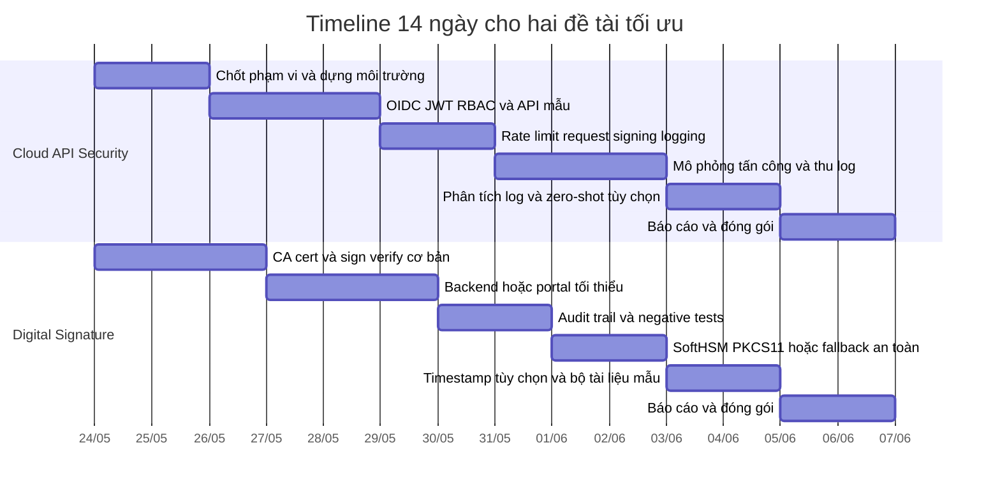

# Executive Summary và lựa chọn đề tài từ ZIP cho POC không train AI

## Executive Summary

Tôi **đã mở được file `/mnt/data/Projects.zip`** và đọc trực tiếp các file mô tả đề tài bên trong. ZIP này không phải bộ đề tài ML thuần túy; phần lớn nội dung nghiêng về **cryptography, API security, cloud security, payment, PKI, PQC và blockchain**. Vì vậy, nếu giữ đúng ràng buộc của bạn là **không train AI**, thời gian chỉ **khoảng hai tuần**, trình độ hiện tại còn hạn chế, và GPU duy nhất là **RTX 500 Ada 4GB VRAM**, thì hướng tối ưu không phải là chọn các đề tài AI/ML nặng, mà là chọn các đề tài có thể làm theo kiểu **prototype engineering + phân tích + inference-only khi cần**. Về phần cứng, RTX 500 Ada laptop GPU có **4GB VRAM, 2,048 CUDA cores, 64 Tensor Cores, băng thông 128GB/s và TGP 35–60W**, nên đây không phải cấu hình lý tưởng cho các hướng cần huấn luyện mô hình lớn; bù lại, nó đủ để chạy các tác vụ nhẹ hoặc hoàn toàn có thể “bỏ qua GPU” nếu dùng **hosted inference** thay vì local inference. citeturn1search0turn3search0turn3search1

Sau khi sàng lọc theo tiêu chí **không train**, **dễ hoàn thành trong hai tuần**, **ít phụ thuộc GPU**, **phù hợp người mới**, và **đầu ra có thể nộp được ngay**, hai đề tài tối ưu nhất từ ZIP là:

- **Capstone Project — Cloud API‑Based Network Application Security for Small Company Services**
- **Capstone Project — Digital Signature for Public Administrative Services via Citizen Services Portal**

Lý do chọn hai đề tài này là vì chúng có thể làm thành **POC không cần huấn luyện mô hình**, tận dụng tốt stack chuẩn công nghiệp. Với đề tài API security, có thể dùng **Keycloak/OIDC + JWT + reverse proxy + log analysis**, và nếu muốn thêm “AI” thì chỉ dùng **Hugging Face Inference API** cho **zero-shot classification** hoặc **embeddings** để gắn nhãn/log triage, hoàn toàn không train. Với đề tài chữ ký số, phần cốt lõi có thể làm bằng **OpenSSL, X.509, SoftHSM/PKCS#11** và một portal/API nhỏ; đây là hướng rất “sạch” về mặt không-train, vẫn đủ chất nghiên cứu ứng dụng. Tài liệu chính thức của Hugging Face cho biết `InferenceClient` dùng được với **Inference API**, **Inference Endpoints** hay **Inference Providers**, zero-shot classification chỉ cần văn bản và nhãn ứng viên, còn feature extraction biến văn bản thành vector để làm similarity/RAG mà không phải huấn luyện gì thêm. citeturn3search0turn3search1turn0search1turn7search0turn2search0

Khuyến nghị chốt cuối cùng của tôi là:

| Mức ưu tiên | Đề tài | Lý do |
|---|---|---|
| **Ưu tiên cao nhất** | **Cloud API‑Based Network Application Security for Small Company Services** | Dễ chia nhỏ phạm vi, dễ demo, ít rủi ro tiến độ, không cần dataset công khai hay GPU |
| **Ưu tiên thứ hai** | **Digital Signature for Public Administrative Services via Citizen Services Portal** | Phạm vi rõ, đầu ra đẹp, bám sát cryptography ứng dụng, hoàn toàn không cần train |

## Nội dung ZIP đã truy cập và giả định làm việc

Tôi truy cập được ZIP và thấy tổng cộng **32 mục**, gồm **25 file mô tả đề tài dạng Markdown**, **1 file framework Markdown**, **3 file DOCX**, **1 file PDF**, và **1 thư mục `Projects/`**. Để sàng lọc, tôi ưu tiên đọc các file `.md` vì chúng cho nội dung tóm tắt đề tài rõ nhất.

Danh sách tên file trong ZIP:

```text
Projects/
Projects/01_AI-based Side-Channel Attack Detection.md
Projects/02_Deep Learning for Cryptanalysis (AES toy-size).md
Projects/03_Generative AI for KeyNonce Management.md
Projects/04_Anomaly Detection in TLSSSH Handshakes & Certificates.md
Projects/05_Implement & Benchmark Lattice-based Schemes (Kyber, Dilithium).md
Projects/06_Hybrid Classical + PQC TLS Handshake (ECDHE + Kyber).md
Projects/07_ Post‑Quantum Blockchain Thử nghiệm chữ ký Dilithium  Falcon cho Smart Contract.md
Projects/08_Migration Tool Hỗ trợ thay thế RSAECC bằng PQC cho API  OpenSSL.md
Projects/08_Secure API Gateway with Cryptographic Enforcement.md
Projects/09_Zero‑Trust API Authentication.md
Projects/10_Confidential Computing_Encrypted APIs.md
Projects/11_Cryptanalysis on Symmetric Ciphers DES and AES.md
Projects/12_Cryptanalysis on Asymmetric Ciphers RSA and RSA‑Based Signatures.md
Projects/13_Cryptanalysis on Asymmetric Ciphers ECC and ECC‑Based Signatures.md
Projects/14_Cryptanalysis on Lattice‑Based Algorithms_Focus Round‑3 RejectedNon‑Selected Candidates.md
Projects/15_Cryptanalysis on Lattice‑Based Algorithms_FIPS 203204205 Kyber, Dilithium, SPHINCS.md
Projects/16_Multimedia Product Service Platform Netflix, Spotify).md
Projects/17_Application Scenarios Online Shopping Service Platform.md
Projects/18_Encryption, Access Control and Secure Query in Cloud‑Native DBMS.md
Projects/19_Secure Network Protocols in IoT‑based Traffic Monitor for Smart Cities.md
Projects/20_Secure Commercial Transactions and Payment Gateway.md
Projects/21_Cloud API‑Based Network Application Security for Small Company Services.md
Projects/22_Digital Signature for Public Administrative Services via Citizen Services Portal.md
Projects/23_Attribute‑based Access Policy and Attribute‑based Encryption for Healthcare Systems.md
Projects/24_. Ứng dụng Mã hóa Đồng cấu (Homomorphic Encryption) cho Dịch vụ Tài chính Liên Ngân hàng.md
Projects/25_Kết hợp ZKP và Thuật toán Hậu‑Lượng tử (PQC) cho Mạng Blockchain.md
Projects/Framework for Capstone Project.docx
Projects/Framework Tailoring for Implementation and Theoretical Research.md
Projects/New_Project.docx
Projects/Projects-Topics.docx
Projects/Projects-Topics.pdf
```

Các giả định tôi dùng để chốt đề xuất là:
- **Không train AI** theo đúng yêu cầu của bạn.
- Mục tiêu là **POC** và **nộp được** trong khoảng **14 ngày**.
- Nếu có dùng AI, chỉ dùng theo kiểu **inference-only**: zero-shot classification, embeddings, prompt engineering, retrieval, hoặc hosted API.
- **Dataset tối đa không cần vượt 10GB**, và với hai đề tài được chọn thì thực tế còn nhỏ hơn nhiều.
- GPU là **RTX 500 Ada 4GB**, nhưng ở hai đề tài cuối, **GPU gần như không phải tài nguyên quyết định**; nếu dùng hosted inference thì local GPU gần như bằng **0**. citeturn1search0turn3search0turn3search1

## Sàng lọc đề tài từ ZIP

Dưới đây là **5 đề tài tôi chọn ra từ ZIP** vì chúng phù hợp nhất với tiêu chí “không train AI, dễ làm trong 2 tuần, phù hợp người mới hơn các đề tài còn lại”. Tôi giữ nguyên **tiêu đề gốc trong ZIP** ở cột đầu tiên. Các trích đoạn là nội dung tôi đọc trực tiếp từ ZIP; dấu `...` xuất hiện ngay trong tài liệu gốc.

| Tiêu đề gốc trong ZIP | Trích đoạn mô tả từ ZIP | Vì sao phù hợp với không train AI |
|---|---|---|
| **Capstone Project — Cloud API‑Based Network Application Security for Small Company Services** | “Đề tài hướng dẫn sinh viên thiết kế, triển khai và đánh giá ... e‑commerce microservice, or internal admin API), tập trung vào: bảo vệ mặt phẳng API, bảo vệ luồng mạng, logging, tracing, alerting, SIEM nhẹ...” | Có thể làm hoàn toàn bằng **thiết kế hệ thống + triển khai bảo mật + phân tích log**. Nếu cần thêm AI thì chỉ dùng **zero-shot** hoặc **embeddings** để phân loại log, không cần train. |
| **Capstone Project — Digital Signature for Public Administrative Services via Citizen Services Portal** | “Đề tài thiết kế, triển khai và đánh giá một hệ thống chữ ký số... Sinh viên phải: thiết kế dòng ký end‑to‑end, triển khai PoC: portal + client signing demo + remote signing server (SoftHSM / PKCS#11)...” | Trọng tâm là **PKI, ký số, xác minh, timestamp, audit trail**. Toàn bộ có thể làm bằng OpenSSL/SoftHSM; **không cần AI**. |
| **Capstone Project — Secure API Gateway with Cryptographic Enforcement** | “Đề tài tập trung vào thiết kế, triển khai và đánh giá một ... trong môi trường cloud (k8s + managed services).” | Có thể rút gọn thành POC **gateway + JWT/HMAC/request signing**. Không cần dataset và không cần train. |
| **Capstone Project — Secure Commercial Transactions & Payment Gateway** | “Đề tài hướng tới thiết kế một hệ thống giao dịch thương mại... và đề xuất chính sách vận hành & kỹ thuật để vận hành an toàn.” | Có thể làm dạng **sandbox thanh toán + tokenization + threat analysis**. Không cần train, nhưng phạm vi hơi rộng hơn. |
| **Capstone Project — Zero‑Trust API Authentication: Proxy with mTLS + Token‑Based Signatures** | “Đề tài hướng dẫn thiết kế, triển khai và đánh giá một Zero‑Trust... phân tích threat model, thiết kế kiến trúc proxy..., repo reproducible (Docker/Helm), báo cáo và demo.” | Không cần train, nhưng đòi hỏi hiểu **mTLS, cert lifecycle, token binding** nên khó hơn người mới. |

Nếu chấm thuần theo độ “an toàn khi làm trong 14 ngày”, thứ tự nên là:

| Đề tài | Phù hợp người mới | Khớp 2 tuần | Không train | Rủi ro kỹ thuật | Kết luận |
|---|---:|---:|---:|---:|---|
| Cloud API‑Based Network Application Security | **5/5** | **5/5** | **5/5** | **Thấp–trung bình** | **Rất nên chọn** |
| Digital Signature for Public Administrative Services | **4/5** | **4/5** | **5/5** | **Trung bình** | **Rất nên chọn** |
| Secure API Gateway with Cryptographic Enforcement | **4/5** | **4/5** | **5/5** | **Trung bình** | Nên chọn nếu thích API/gateway |
| Secure Commercial Transactions & Payment Gateway | **3/5** | **3/5** | **5/5** | **Trung bình–cao** | Khả thi nhưng hơi rộng |
| Zero‑Trust API Authentication | **2/5** | **3/5** | **5/5** | **Cao** | Khá hay nhưng không tối ưu cho người mới |

Lý do tôi **không ưu tiên** các đề tài như *AI-based Side-Channel Attack Detection*, *Deep Learning for AES Cryptanalysis*, *Anomaly Detection in TLS/SSH*, *Confidential Computing*, *Homomorphic Encryption*, hay *ZKP + PQC Blockchain* là vì hoặc chúng **nghiêng mạnh về AI/ML**, hoặc **quá nặng về lý thuyết/cryptography nâng cao**, hoặc **phạm vi hệ thống quá rộng** so với 2 tuần và trình độ đầu vào hạn chế.

## Hai đề tài tối ưu và kế hoạch thực hiện trong hai tuần

### Đề tài tối ưu về API security

**Đề tài chọn:** **Capstone Project — Cloud API‑Based Network Application Security for Small Company Services**

Đây là đề tài mạnh nhất nếu mục tiêu là “**ra sản phẩm POC chắc tay trong 14 ngày**”. Nó cho phép bạn làm theo kiểu **engineering-first**, gần như không phụ thuộc GPU, và vẫn có không gian để thêm chút “AI” ở lớp **inference-only** cho log triage. Về mặt chuẩn kỹ thuật, Keycloak hỗ trợ OpenID Connect/OAuth2 endpoint chuẩn để lấy token và user info; JWT là định dạng claim compact, URL-safe; và OWASP API Security Top 10 2023 cung cấp một checklist rất tốt để chọn các kịch bản tấn công cần mô phỏng cho báo cáo. Nếu muốn có thành phần AI mà không train, Hugging Face `InferenceClient` có thể gọi trực tiếp **Inference API** hoặc **Inference Providers**, còn zero-shot classification và feature extraction đều là các task chính thức được hỗ trợ. citeturn0search3turn0search7turn6search3turn6search6turn0search6turn0search18turn3search0turn3search1turn0search1turn7search0turn2search0

#### Phạm vi đề tài đã rút gọn để không train

Thay vì làm toàn bộ hệ thống cloud security lớn, bạn chỉ cần làm một **dịch vụ API nhỏ cho công ty giả lập**. Ví dụ:
- `catalog` public,
- `orders` cần user login,
- `admin` chỉ cho role admin,
- webhook ký HMAC,
- log mọi request và mô phỏng một vài cố tình tấn công.

Điểm quan trọng là **không huấn luyện mô hình nào cả**. Toàn bộ phần “thông minh” được thực hiện bằng:
- **phân tích log + feature engineering đơn giản**,
- **rule-based detection**,
- và **optional**: dùng **zero-shot classification** từ Hugging Face để gắn nhãn mô tả log như `auth_error`, `suspicious_input`, `rate_limit_abuse`, `expired_token`, `normal`. Zero-shot theo tài liệu Hugging Face chỉ cần gửi văn bản và danh sách nhãn ứng viên, không phải tạo tập nhãn để huấn luyện. citeturn0search1turn2search0turn3search0

#### Bảng triển khai chi tiết

| Hạng mục | Đề xuất cụ thể |
|---|---|
| Mô tả đề tài | Xây dựng dịch vụ API nhỏ cho SME, bảo vệ bằng OIDC/JWT, RBAC, rate limiting, webhook signing, logging và mô phỏng tấn công theo OWASP API Top 10 |
| Mục tiêu cụ thể | Có login OIDC; có endpoint phân quyền; có rate limit; có request/webhook signing; có log rõ ràng; có dashboard hoặc notebook phân tích; có demo 5 kịch bản tấn công/thất bại |
| Dữ liệu cần thiết | **Không cần dataset công khai bắt buộc**. Dùng **300–1,000 log dòng** sinh ra từ chính POC bằng Postman/cURL/Locust. Dữ liệu nên ở dạng JSONL/CSV, thường chỉ **< 50MB** |
| Cách tiền xử lý | Parse timestamp, path, method, status code, user id, role, IP, user-agent, auth outcome; thêm feature như `failed_auth_count`, `requests_per_minute`, `unknown_path`, `signature_valid` |
| Phương pháp không train | Rule-based checks; phân tích log; optional **zero-shot classification** bằng HF Inference API; optional **feature extraction embeddings** để nhóm log/sự cố tương tự |
| Công cụ/libraries | `FastAPI`, `Keycloak`, `Docker Compose`, `pandas`, `matplotlib`, `requests`, `huggingface_hub`, có thể thêm `Locust` để tạo traffic |
| Thời gian từng phần | Môi trường 4–6h; auth/RBAC 6–8h; request signing + rate limit 5–7h; mô phỏng tấn công 4–6h; log analysis/zero-shot 4–6h; báo cáo và README 6–8h |
| Tổng thời gian thực tế | Khoảng **29–41 giờ làm việc hiệu quả**, rất vừa với 14 ngày nếu làm 2–3 giờ/ngày |
| Yêu cầu GPU/bộ nhớ | **GPU: không bắt buộc**; nếu dùng HF hosted inference thì local VRAM gần như **0GB**. RAM hệ thống nên có **4–8GB** để chạy Docker/Keycloak thuận tiện |
| Mức độ khó | **3/5** |
| Kỹ năng cần có | Python cơ bản, Docker cơ bản, HTTP/REST, JSON, đọc log, hiểu token/JWT ở mức sử dụng |
| Rủi ro | Cấu hình Keycloak dễ rối; gateway quá nặng; log chưa đủ đẹp cho phân tích; phụ thuộc mạng nếu gọi hosted inference |
| Cách giảm thiểu | Chỉ dùng **1 realm, 1 client, 2 role**; nếu gateway quá phức tạp thì chuyển bớt logic vào app; coi zero-shot là **optional add-on**, không phải lõi đề tài |
| Kết quả đầu ra mong đợi | Báo cáo PDF/Markdown, sơ đồ kiến trúc, `docker-compose.yml`, code API, log mẫu, notebook phân tích, script mô phỏng tấn công, README chạy demo |

Gợi ý stack nhẹ và thực tế nhất là:
- **FastAPI** làm API mẫu,
- **Keycloak** làm IdP/OIDC,
- **Docker Compose** để gom toàn bộ dịch vụ,
- **`huggingface_hub.InferenceClient`** nếu bạn muốn có phần log triage bằng zero-shot hoặc embeddings,
- **pandas + notebook** để phân tích log sau khi chạy thử nghiệm. Hugging Face tài liệu hóa rõ `InferenceClient` như một interface thống nhất cho inference serverless hoặc provider-side, còn feature extraction biến văn bản thành embedding để làm similarity/reranking, rất hợp cho log grouping không-train. citeturn3search0turn3search2turn7search0turn7search2

#### Checklist hằng ngày cho mười bốn ngày

| Ngày | Việc cần làm | Đầu ra cần có |
|---|---|---|
| Ngày 1 | Chốt phạm vi: chọn 3 endpoint, 2 role, 5 tình huống tấn công | File scope và kiến trúc sơ bộ |
| Ngày 2 | Tạo repo, `docker-compose`, dựng FastAPI skeleton | Repo chạy được endpoint mẫu |
| Ngày 3 | Cài Keycloak, tạo realm/client/user/role | Đăng nhập và cấp token thành công |
| Ngày 4 | Gắn JWT/OIDC vào API, phân quyền role `user/admin` | Endpoint bảo vệ được |
| Ngày 5 | Thêm reverse proxy hoặc middleware bảo vệ cơ bản | Flow request qua proxy/app hoạt động |
| Ngày 6 | Thêm rate limiting, webhook/request signing | Có ít nhất một endpoint ký HMAC |
| Ngày 7 | Chuẩn hóa logging: format JSONL/CSV, lưu status/auth/IP | Log đọc được bằng pandas |
| Ngày 8 | Viết script mô phỏng 5 tình huống: thiếu token, token hết hạn, sai role, replay, burst traffic | Bộ script test đầu tiên |
| Ngày 9 | Chạy test, thu log, sửa lỗi xác thực và phân quyền | Log thật từ các kịch bản |
| Ngày 10 | Viết notebook phân tích log, thống kê lỗi và attack surface | Notebook EDA/log analysis |
| Ngày 11 | Nếu còn thời gian: tích hợp HF zero-shot hoặc embeddings cho triage log | Demo inference-only hoạt động |
| Ngày 12 | Chụp ảnh màn hình, viết use-case và kết quả đo latency cơ bản | Hình minh họa và metric |
| Ngày 13 | Viết báo cáo: kiến trúc, threat model, test cases, kết quả | Bản nháp báo cáo hoàn chỉnh |
| Ngày 14 | Dọn repo, README, script chạy một lệnh, đóng gói đầu ra | Bản nộp hoàn chỉnh |

### Đề tài tối ưu về chữ ký số

**Đề tài chọn:** **Capstone Project — Digital Signature for Public Administrative Services via Citizen Services Portal**

Nếu bạn muốn một đề tài **ít phần mạng hơn, nhiều phần “mật mã ứng dụng” hơn**, đây là lựa chọn thứ hai rất mạnh. Nội dung ZIP đã mô tả rõ hướng đi là **portal + client signing demo + remote signing server (SoftHSM/PKCS#11)**. Về công cụ, `cryptography` tài liệu hóa X.509 theo RFC 5280; OpenSSL `cms` hỗ trợ **sign/verify** dữ liệu CMS; OpenSSL `ts` hỗ trợ **time-stamping** theo RFC 3161; và SoftHSM là một **software HSM** giao tiếp qua **PKCS#11**, rất phù hợp để mô phỏng lưu khóa và ký mà không cần mua HSM phần cứng. citeturn4search0turn4search15turn4search1turn4search14turn5search0

#### Phạm vi đề tài đã rút gọn để không train

Bạn không cần làm đầy đủ một “cổng hành chính công” thật. Phạm vi an toàn trong hai tuần là:
- trang upload tài liệu,
- ký số tài liệu bằng certificate nội bộ,
- xác minh chữ ký,
- lưu audit trail,
- tùy chọn thêm timestamp hoặc kiểm tra tình trạng cert ở mức mô phỏng.

Để **tránh trượt tiến độ**, tôi khuyên nên làm theo thứ tự:
1. ký/xác minh file văn bản hoặc JSON trước,
2. sau đó mới mở rộng sang PDF,
3. sau cùng mới thêm SoftHSM hoặc timestamp nếu còn thời gian.

Cách làm này vẫn đúng tinh thần đề tài gốc, nhưng giảm đáng kể rủi ro kỹ thuật.

#### Bảng triển khai chi tiết

| Hạng mục | Đề xuất cụ thể |
|---|---|
| Mô tả đề tài | Xây dựng portal/API nhỏ cho phép người dùng tải tài liệu, ký số, xác minh chữ ký và lưu audit trail bằng X.509 + OpenSSL/SoftHSM |
| Mục tiêu cụ thể | Tạo cert nội bộ; ký file; xác minh đúng/sai; hiển thị signer, thời gian, trạng thái xác minh; có ít nhất 10–20 tài liệu mẫu để trình diễn |
| Dữ liệu cần thiết | **Không cần dataset công khai**. Tự tạo **10–30 tài liệu mẫu** dạng PDF, TXT hoặc JSON; tổng dung lượng thường **< 100MB** |
| Cách tiền xử lý | Tính hash tài liệu; chuẩn hóa metadata người ký; nếu là PDF thì giữ nguyên byte stream và dùng detached signature nếu muốn đơn giản hóa |
| Phương pháp không train | PKI/X.509, CMS detached signature, verify certificate chain, optional RFC3161 timestamp, audit trail; **không dùng AI** |
| Công cụ/libraries | `OpenSSL`, `SoftHSMv2`, `cryptography`, `FastAPI` hoặc `Flask`, `Docker Compose`, `sqlite`/`postgres` để lưu audit log |
| Thời gian từng phần | PKI/cert 4–6h; sign/verify CLI 6–8h; portal/API 6–8h; SoftHSM/PKCS#11 4–6h; timestamp/negative tests 3–5h; báo cáo 6–8h |
| Tổng thời gian thực tế | Khoảng **29–41 giờ làm việc hiệu quả** |
| Yêu cầu GPU/bộ nhớ | **GPU: 0GB cần thiết**; CPU là đủ. RAM hệ thống **2–4GB** là dùng được, **4–8GB** thì thoải mái hơn nếu chạy Docker |
| Mức độ khó | **3/5** |
| Kỹ năng cần có | Python cơ bản, CLI cơ bản, hiểu file/cert/key, HTTP mức cơ bản |
| Rủi ro | PDF signing có thể phức tạp; PKCS#11/SoftHSM có thể khiến bạn mất thời gian cấu hình; timestamp là phần dễ phát sinh nhất |
| Cách giảm thiểu | Hoàn thành **CLI sign/verify** trước; nếu PDF khó quá thì dùng **detached signature** thay vì full PDF signing; coi timestamp là “nice-to-have” |
| Kết quả đầu ra mong đợi | Báo cáo, code portal/API, script sign/verify, sample cert/CSR, tài liệu mẫu đã ký, audit log, README |

Điểm mạnh của đề tài này là phần cốt lõi được hỗ trợ tốt bởi các chuẩn và công cụ chính thức. X.509 là nền tảng phổ biến của PKI; OpenSSL có sẵn lệnh cho **CMS sign/verify** và **time-stamping**; SoftHSM mô phỏng HSM qua PKCS#11 và cho phép khởi tạo token, lưu khóa và tương tác với ứng dụng mà không cần phần cứng thật. Điều đó khiến đề tài vừa đủ “nghiên cứu ứng dụng”, vừa ít rủi ro do không phải huấn luyện mô hình hay phụ thuộc GPU. citeturn4search0turn4search1turn4search14turn5search0

#### Checklist hằng ngày cho mười bốn ngày

| Ngày | Việc cần làm | Đầu ra cần có |
|---|---|---|
| Ngày 1 | Chốt phạm vi: loại tài liệu, kiểu ký, có/không có timestamp | Scope rõ ràng và luồng xử lý |
| Ngày 2 | Cài OpenSSL, tạo CA nội bộ, tạo cert người ký đầu tiên | Bộ cert và key thử nghiệm |
| Ngày 3 | Làm thử sign/verify bằng CLI trên file TXT/JSON | Có file ký và xác minh thành công |
| Ngày 4 | Viết script Python hoặc wrapper để sign/verify tự động | Script chạy một lệnh |
| Ngày 5 | Thiết kế audit log: signer, doc hash, time, verify status | Schema log hoặc DB nhỏ |
| Ngày 6 | Dựng backend nhỏ bằng FastAPI/Flask | Upload file và gọi sign/verify được |
| Ngày 7 | Tạo giao diện tối thiểu hoặc endpoint test dễ trình diễn | Demo web/API cơ bản |
| Ngày 8 | Tích hợp SoftHSM hoặc chuẩn bị module PKCS#11 giả lập | Ký bằng token/software HSM hoặc fallback plan |
| Ngày 9 | Thêm verify chain, cảnh báo cert sai/hết hạn/oops cases | Bộ negative tests |
| Ngày 10 | Nếu còn thời gian: thêm timestamp bằng OpenSSL `ts` | Timestamp demo hoặc ghi chú fallback |
| Ngày 11 | Chuẩn bị bộ tài liệu mẫu 10–20 file và chạy kịch bản thật | Bộ sample input/output |
| Ngày 12 | Chụp ảnh màn hình, hoàn thiện UX tối thiểu, sửa lỗi | Demo mượt, dễ chạy |
| Ngày 13 | Viết báo cáo: kiến trúc, PKI flow, sign/verify flow, limitations | Bản thảo báo cáo |
| Ngày 14 | Dọn repo, README, hướng dẫn tạo cert và chạy demo | Bản nộp cuối |

### Bảng tóm tắt cuối cùng cho hai lựa chọn tối ưu

| Tiêu chí | Cloud API‑Based Network Application Security | Digital Signature for Public Administrative Services |
|---|---|---|
| Mức phù hợp tổng thể | **Rất cao** | **Cao** |
| Có cần train AI không | **Không** | **Không** |
| Có thể thêm inference-only không | **Có, rất hợp** | **Có thể, nhưng không cần** |
| Cần dataset công khai không | **Không bắt buộc** | **Không bắt buộc** |
| GPU có vai trò gì | Gần như không; hosted inference thì 0GB local VRAM | Hầu như không dùng GPU |
| Mức khó | **3/5** | **3/5** |
| Nguy cơ trượt tiến độ | Thấp hơn | Trung bình |
| Giá trị demo | Cao | Cao |
| Loại sản phẩm đầu ra | API demo + log analysis + security report | Portal/API ký số + audit + security report |

### Timeline tổng hợp cho mười bốn ngày



## Các đề tài khả thi khác không train

Năm đề tài dưới đây vẫn **khả thi** nếu bạn thích đúng hướng nội dung của ZIP, nhưng chúng **không tối ưu bằng hai đề tài đã chốt**. Trong bảng này, cột **Độ khó** dùng thang **1 = dễ nhất, 5 = khó nhất**.

| Đề tài từ ZIP | Thời gian | GPU inference-only | Dữ liệu | Độ khó | Ứng dụng thực tế | Nhận xét ngắn |
|---|---:|---:|---:|---:|---:|---|
| Secure API Gateway with Cryptographic Enforcement | 4/5 | 5/5 | 5/5 | 3/5 | 5/5 | Tốt nếu bạn thích gateway/JWT/HMAC, nhưng hơi trùng ý với đề tài API security tối ưu |
| Zero‑Trust API Authentication | 3/5 | 5/5 | 5/5 | 4/5 | 5/5 | Rất hay về kỹ thuật, nhưng mTLS + PoP + cert binding làm tăng độ khó đáng kể |
| Secure Commercial Transactions & Payment Gateway | 3/5 | 5/5 | 4/5 | 4/5 | 5/5 | Giá trị ứng dụng cao nhưng phạm vi payment, tokenization, fraud, PCI dễ bị rộng |
| Application Scenarios: Online Shopping Service Platform | 3/5 | 5/5 | 4/5 | 4/5 | 5/5 | Rất thực tế nhưng quá rộng cho 2 tuần nếu muốn làm demo đàng hoàng |
| Encryption, Access Control & Secure Query in Cloud‑Native DBMS | 2/5 | 5/5 | 4/5 | 5/5 | 4/5 | Hay về kỹ thuật nhưng dễ trượt tiến độ vì phần secure query và leakage analysis khó với người mới |

Nếu buộc phải chọn **một đề tài thay thế** ngoài hai đề tài tối ưu, tôi sẽ xếp:
- **thay thế một:** *Secure API Gateway with Cryptographic Enforcement*,
- **thay thế hai:** *Secure Commercial Transactions & Payment Gateway*.

## Kết luận và giới hạn

Kết luận ngắn gọn là: **đừng chọn các đề tài AI/ML trong ZIP** nếu bạn đã xác định rõ là **không train AI** và chỉ có **2 tuần**. Dù RTX 500 Ada có Tensor Cores và có thể chạy inference nhẹ, 4GB VRAM là một ngân sách phần cứng khá hẹp nếu đi theo hướng mô hình nặng; trong khi đó, hai đề tài tôi chọn gần như **không cần GPU**, hoặc nếu muốn thêm yếu tố AI thì chỉ dùng **hosted inference** qua API. Điều này khiến rủi ro kỹ thuật và rủi ro tiến độ thấp hơn nhiều. citeturn1search0turn3search0turn3search1

Nếu mục tiêu của bạn là **chắc chắn nộp được**, hãy chọn **Cloud API‑Based Network Application Security for Small Company Services**. Nếu mục tiêu là **một đề tài mật mã ứng dụng có đầu ra đẹp, rõ luồng nghiệp vụ và ít dính hạ tầng mạng hơn**, hãy chọn **Digital Signature for Public Administrative Services via Citizen Services Portal**.

Giới hạn của báo cáo này là: tôi đọc trực tiếp được các file mô tả trong ZIP, nhưng không có cơ chế trích dẫn dòng-chuẩn từ chính ZIP trong định dạng citation web. Vì vậy, các **trích đoạn mô tả đề tài** trong báo cáo là phần tôi **đọc trực tiếp từ file ZIP đã tải lên**, còn các nhận định về **công cụ, chuẩn, API, phần cứng và phương pháp inference-only** đều đã được neo vào **nguồn chính thức** như NVIDIA, Hugging Face, OWASP, RFC Editor, OpenSSL, `cryptography` và SoftHSM. citeturn0search6turn6search3turn6search6turn4search1turn4search14turn5search0
